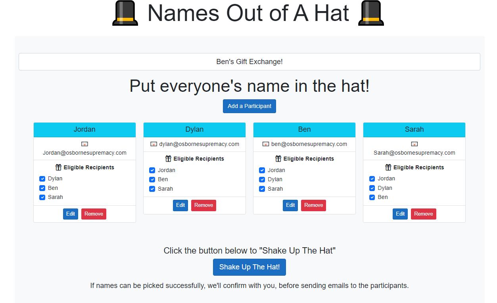
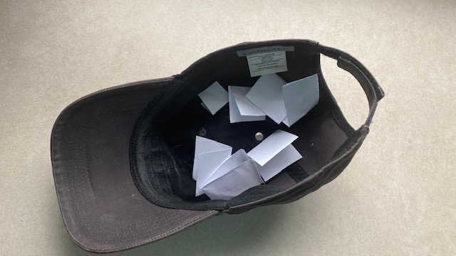
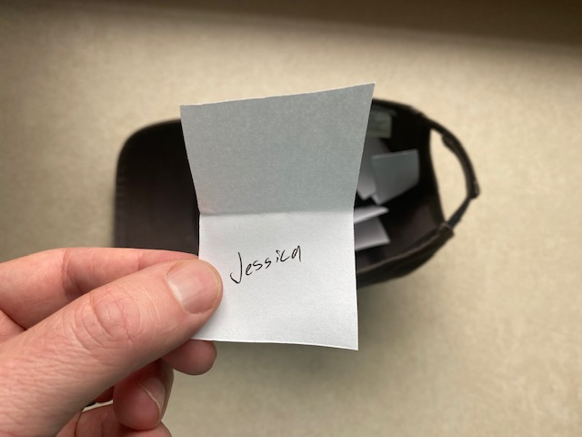

# Names Out Of A Hat Blazor

A web application to facilitate a "names out of hat" type gift exchange, written with Blazor.



## What is a "Names Out Of A Hat" type gift exchange?

Most people probably know what this is, but I'm including a description for those who don't.

For families / groups that organize Christmas or other holiday gift exchanges, they can get expensive / excessive when everyone buys a gift for everyone else.

As a solution to that, some groups have everyone buy a gift for just one other person. That is a determined through a drawing:

1. Everyone writes their name on a piece of paper.

2. All names are put into a hat.

3. The hat is shaken.
4. Names are drawn one at a time.

5. The person drawing the name does not reveal it to anyone else.
6. If someone draws their own name (or in some variations, the name of their spouse / significant other), all names are put back in the hat, and the process is restarted.

## Why create an application to do this?

My main motivation was to be able to have the names drawn and distributed remotely. My family usually meets around Christmas Day every year. Ideally we'd know who we need to buy a gift for around Thanksgiving or earlier, but we're not always together around that time.

Here are all of the advantages that I can think of that a web application has over the paper / physical hat method:

* The drawing can be done remotely.
* A participant cannot draw their own name or the name of any _ineligible_ person (e.g. their spouse.)
* The list of ineligible recipients is flexible.
    * For groups with a small number of people, it's very possible that someone can draw the same name 2 or more years in a row. This can be prevented by marking a recipient as ineligible for certain participants.
* It is completely fair (not that fairness is a major concern when it comes to gift exchanges). Both the order in which people draw names, and the drawing of the names, is done randomly.
* Gift exchanges with complex resolutions can be found.

### Approach To Drawing Names

In most cases, each participant in the gift exchange will have the same number of eligible recipients.

For example, in my family's gift exchange, there are 3 couples. We exclude our spouses and the person whose name we drew last year. So there are 6 people, each with 3 eligible recipients.

In cases like that, there's no optimal approach as to which participant should draw first, because everyone's equal in terms of how many eligible recipients they have, and how many participants they are an eligible recipient for.

But imagine a more complex scenario, like this:

| Participant | Alpha (Eligible) | Beta (Eligible) | Charlie (Eligible) | Delta (Eligible) | Echo (Eligible) | Foxtrot (Eligible) | Golf (Eligible) | Hotel (Eligible) | India (Eligible) | Juliet (Eligible) |
| ----------- | ---------------- | --------------- | ------------------ | ---------------- | --------------- | ------------------ | --------------- | ---------------- | ---------------- | ----------------- |
| Alpha       | No               | Yes             | Yes                | Yes              | Yes             | Yes                | Yes             | Yes              | Yes              | Yes               |
| Beta        | Yes              | No              | Yes                | Yes              | Yes             | Yes                | Yes             | Yes              | Yes              | No                |
| Charlie     | Yes              | Yes             | No                 | Yes              | Yes             | Yes                | Yes             | Yes              | Yes              | No                |
| Delta       | Yes              | Yes             | Yes                | No               | Yes             | Yes                | Yes             | Yes              | Yes              | No                |
| Echo        | Yes              | Yes             | Yes                | Yes              | No              | Yes                | Yes             | Yes              | Yes              | No                |
| Foxtrot     | Yes              | Yes             | Yes                | Yes              | Yes             | No                 | Yes             | Yes              | Yes              | No                |
| Golf        | Yes              | Yes             | Yes                | Yes              | Yes             | Yes                | No              | Yes              | Yes              | No                |
| Hotel       | Yes              | Yes             | Yes                | Yes              | Yes             | Yes                | Yes             | No               | Yes              | No                |
| India       | Yes              | Yes             | Yes                | Yes              | Yes             | Yes                | Yes             | Yes              | No               | No                |
| Juliet      | Yes              | Yes             | Yes                | Yes              | Yes             | Yes                | Yes             | Yes              | Yes              | No                |

The name that should stand out is Juliet. Juliet is only an eligible recipient for Alpha. If Alpha draws any other name than Juliet, Juliet won't be picked by anyone, and the process needs to start over.

I could have tried to address that with the name picking algorithm (e.g. make it so that Alpha picks last). But I didn't want to, for the sake of maintaining randomness. It's not a huge problem if the process has to start over, since the application can keep running scenarios until the gift exchange succeeds.

So I'm taking a brute force approach to picking names. I'm not trying to find an elegant solution for difficult scenarios like the one above.

There is a limit to the number of times the application will attempt to successfully resolve a gift exchange. That limit can be increased. I don't anticipate that being necessary, however. If the application needs to handle gift exchanges that complex, it might be worth trying smarter algorithms after _n_ failed attempts with the brute force algorithm.

## Running the Application

### Prerequisites

The application uses SendGrid to send emails. This is abstracted with `IEmailService`, so if someone wants to use something else, they could create a different implementation.

If you do want to use SendGrid, you'll need an API key. You can register for a free one at [https://app.sendgrid.com/](https://app.sendgrid.com/).

Add the key to **NamesOutOfAHat2\Server\appsettings.json** (or your user secrets, when running locally):

```json
  "configKeys": {
    "sendgrid": "SendGrid API key"
  }
```

In addition, you will need to modify values of the `settings` object as follows:

* `siteUrl`. The URL of the deployed instance of this application. I know that the application can find this, but I thought it was simple enough to store it here.
* `senderName`. The name that you want to appear as the sender of the email.
* `senderEmail`. The email address you want to appear as the sender of the email. You will need to authorize SendGrid to use that email address.
* `sendEmails`. Whether to _really_ send emails. I have three reasons for having this setting.

    1. When running / testing the application locally, I don't want to send/recieve emails.
    2. I want to be able to test the application in production without sending emails.
    3. I want to ensure that anyone else running this application doesn't inadvertently send emails (which is why it is off by default).

### Debugging

In Visual Studio, set `NamesOutOfAHat2.Server` as the startup project and run it.

## Hosting

If hosting on Azure, I recommend that you create an App Configuration with your SendGrid keys and settings. The names of the keys would be:

```
configKeys:sendgrid
settings:senderName
settings:senderEmail
settings:sendEmails
settings:siteUrl
```

In your Azure App Service, you would need just one application setting, pointing to your App Configuration endpoint. That settings should be named `AZURE_CONFIG_CONNECTIONSTRING`. You would get the value from your Azure App Configuration (Access Keys --> Connection String).
