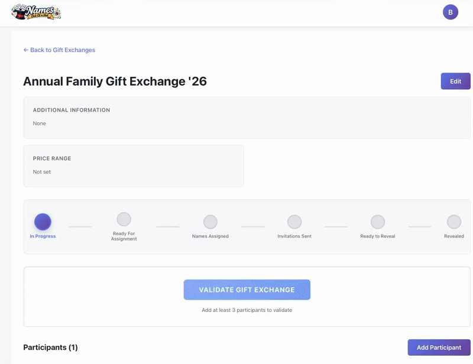
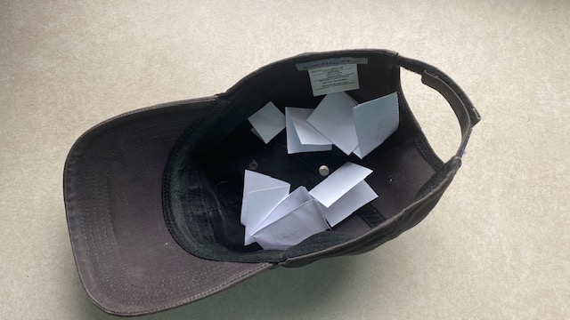
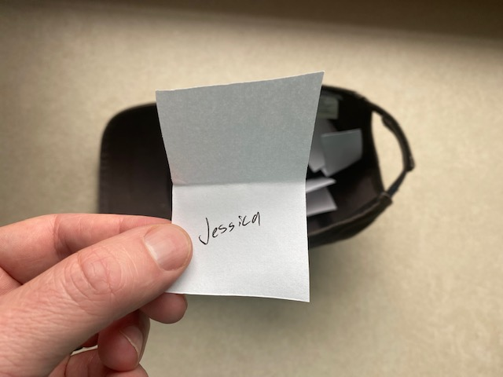

# Names Out Of A Hat

An application for running a "names out of a hat" gift exchange. It's live at [namesoutofahat.com](https://namesoutofahat.com/).



## What is a "names out of a hat" gift exchange?

For families and groups who exchange gifts around Christmas or another holiday, buying for everyone gets expensive fast. The usual fix is that everybody buys for exactly one other person, decided by a drawing:

1. Everyone writes their name on a piece of paper.
2. All the names go into a hat.
3. The hat is shaken.
4. Names are drawn one at a time, and nobody reveals the name they drew.
5. If someone draws their own name — or, in some variations, their spouse's — every name goes back in and the whole thing starts over.

|                                                                      |                                                    |                                                     |
|----------------------------------------------------------------------|----------------------------------------------------|-----------------------------------------------------|
|  |  |  |

The original motivation for building this was simply that my family meets around Christmas Day, but we'd like to know who we're buying for by Thanksgiving — and we're rarely in the same room that early. Everything below is what the application turned out to be good for once the drawing itself stopped being the hard part.

## What this does that a hat cannot

Anything a physical hat does well, it does for free. These are the things it can't do at all.

### Nobody has to be in the same room

The draw happens wherever everyone is, and each person learns who they drew by email.

### The rules are enforced instead of hoped for

Nobody can draw their own name, or the name of anyone marked ineligible for them. With paper, an illegal draw is caught only if the person who drew it says so.

### Ineligibility is per person, and arbitrary

Exclude a spouse. Exclude whoever they drew last year. Exclude a sibling who always guesses. A hat holds one rule — the one everyone remembers to apply — and it applies to everyone equally.

### You can ask what somebody wants without revealing that you drew them

A participant can ask the person whose name they drew what they'd like, and the question arrives without a name on it. They can also ask *around* them — a spouse, a parent, anyone else in the exchange — for people who don't want to tip off the recipient at all. Replies come back by email and are forwarded on with the asker's identity still withheld. The paper equivalent requires a trusted go-between who then knows the answer.

### Gift ideas arrive by replying to an email

No account, no app, no link to click. The address a participant replies to is unique to that conversation, which is how a plain reply gets routed to the right person while staying anonymous.

### You can see whether the invitation actually arrived

Every invitation's delivery status is visible per participant — delivered, bounced, marked as spam, or nothing heard yet. When an address is wrong you can correct just that one and resend to just that person, without disturbing the draw. Hand somebody the wrong slip of paper and it's simply gone.

And you don't have to go and look. A couple of hours after invitations go out, anything that came back is emailed to the organizer, naming the person, the address, and what the receiving server said about it.

### The details travel with the assignment

The price range and any additional instructions are in every invitation, so nobody has to remember the number somebody said out loud in November.

### Next year is one click

A finished exchange can be copied into a new one with the same people and the same rules, and with everybody's recipient from last time excluded automatically. A hat has no memory.

### It ends with a record

When the organizer closes the exchange, everyone receives the full list of who drew whom.

## The lifecycle of an exchange

An exchange moves through a fixed sequence of states, and what's permitted depends on where it is:

| Status                 | What it means                                                                            |
|------------------------|------------------------------------------------------------------------------------------|
| `IN_PROGRESS`          | Being set up. Participants and eligibility can be edited freely.                         |
| `READY_FOR_ASSIGNMENT` | Validated. Still editable, but edits can invalidate it again.                            |
| `NAMES_ASSIGNED`       | The draw has happened. The picks exist and are hidden from everyone.                     |
| `INVITATIONS_SENT`     | Everyone has been told who they drew.                                                    |
| `READY_TO_CLOSE`       | Enough time has passed that closing is unlikely to be an accident.                       |
| `CLOSED`               | The organizer confirmed the exchange happened. Picks are revealed; nothing more changes. |

## Decisions

Most of the interesting decisions in this codebase are about what *not* to do. They're documented at the call sites too; this is the short version.

### The draw is brute force, on purpose

Most exchanges are symmetric — in mine, three couples, spouse and last year's recipient excluded, so six people with three eligible recipients each. Nobody's position is special and draw order doesn't matter.

Asymmetric ones are where it gets interesting. If exactly one person is eligible to draw Juliet, then Juliet gets picked only if that person happens to pick her, and every other outcome deadlocks. An algorithm could fix that by choosing who draws first — but that means the "randomness" is steering, which is the one property the paper version has that's worth keeping.

So the draw shuffles, assigns, and retries with a fresh seed if it deadlocks, up to a limit. It doesn't try to be clever. Failure is cheap and the retry count is a knob. If exchanges ever get complex enough that brute force stops converging, the right move is a smarter algorithm *after* n failed attempts — not instead of them.

Validation is the other half of this: rather than solving hard shapes silently, the app tells the organizer their shape is hard while they can still change it.

### The organizer chooses the shape of the draw

A draw is a permutation of the participants with no fixed point — a derangement — and every permutation decomposes into disjoint cycles. Most of what organizers actually argue about is cycle length. James draws Mary and Mary draws James: a 2-cycle, a mutual pair, two people who have quietly become their own gift exchange. Some groups don't mind. Some mind a lot, and the same people usually mind about a closed triangle inside a group of ten for the same reason.

So the shake asks, in three options that are one setting rather than three:

| Option           | What it means to an organizer                     | What it is                                  |
|------------------|---------------------------------------------------|---------------------------------------------|
| Anything goes    | Any draw where nobody draws themselves            | Any derangement; any cycle structure        |
| No mutual pairs  | Nobody draws the person who drew them             | A derangement with no 2-cycle               |
| Single cycle     | Everybody in one unbroken chain                   | A cyclic permutation — one cycle of length n |

Two things follow from the brute-force decision above. The mutual-pair rule is enforced while the draw is built rather than checked afterwards — a pair needs both halves, so refusing the second half is enough to make 2-cycles unreachable rather than merely unlikely. The single cycle is *constructed*, by walking a random Hamiltonian path and closing it, because filtering for one degrades with the size of the exchange: the share of derangements that are a single cycle falls off as roughly e/n, so at fifty people you would be discarding nineteen draws in twenty for a property you could have built in.

The two constrained options get an order of magnitude more retries than the default, because their failures are more often bad luck than impossibility. When they do exhaust them the organizer is told which rule was in the way, since relaxing it is the one fix that doesn't involve editing anybody's exclusions.

The exclusions themselves are untouched by any of this. They apply to every draw; a draw type can only add to them, which is what the dialog says and what the tests assert for all three options.

The setting belongs to the draw, not to the exchange, so it isn't stored. Once names are out the rule is baked into the assignment and there is nothing left for a stored value to govern — a re-shake is a new draw and gets asked again.

### Cool-off before closing

Closing reveals every pick, permanently, to everybody. It's the only irreversible action in the application, so it isn't available immediately — an exchange has to sit in `INVITATIONS_SENT` for a while before it can be closed, which is enough to stop a mis-click from spoiling everyone's surprise. The transition is made by a scheduled job, not by a timestamp check on read, so the state is a real one rather than a computed one.

### Sign-in is a magic link, and redemption sits behind a button

There are no passwords. Sign-in is a single-use link, valid for fifteen minutes, and only the hash of the token is ever stored — a dump of the table doesn't let anyone redeem pending links.

Single-use links and corporate mail security don't get along. Gateways that scan delivered mail follow links to check them, and a scanner that follows a magic link spends it before the recipient ever sees the email. Redeeming from JavaScript on page load stopped the scanners that fetch without rendering; Proofpoint renders the page in a real browser and ran that fetch itself.

The fix, verified against a live Proofpoint gateway: the token lives in the URL *fragment* (which never reaches the server) and redemption happens when a human presses a button. Scanners render the page; they don't press buttons.

The tempting alternative — allowing a token to be used twice — was rejected. A use count trades away the single-use property against an unbounded number of scanner fetches, and every one of those fetches would be issued a real session token. If this ever stops working, the answer is a typed code that never appears in a link at all.

The request endpoint also always reports success, so it can't be used to find out which addresses have accounts.

### The Ask is two endpoints for one action, for the same reason

The "ask for gift ideas" button lives in an email, so following it is a GET — and the same scanners would fire it on delivery. A GET that sent the request would mail somebody on behalf of a participant who hadn't yet read their invitation, and burn their throttle window doing it.

So the GET only renders the list of people you could ask, which a scanner is welcome to fetch as often as it likes, and the POST behind the button on that page does the work.

Asking is throttled to once a week per pair. The person being asked can't distinguish repeated asks from nagging — they don't know how many people are asking, only how often they're being asked.

### Leaving is a way out that the organizer can't reverse

A participant can be added to an exchange by anybody with an organizer account, and until recently there was no way out of one. Every invitation now carries a leave link in its fine print — never the organizer's own copy, because no leave token is ever issued for them, which is a stronger guarantee than a flag somebody has to remember to check.

It's the same two-endpoint split as the Ask, and the stakes are higher: a GET that acted would remove somebody, send the organizer back to the hat and tell everybody else to disregard their name, all because a mail gateway checked a link. So the GET renders a confirmation form and the POST behind the button does the work.

Leaving removes the participant, and — while invitations are the operative ones — sends the exchange back to `IN_PROGRESS` and tells everybody still in it to disregard the name they were given. That notice names nobody, doesn't say how many are left, and is byte-identical for every recipient, so there's nothing in it to compare. The organizer gets a separate email that does name the person, because they can't run the exchange otherwise, along with the suggestion to ask people before adding them next time. Once an exchange has cooled off or closed, leaving still works but nothing is redrawn and nobody else is told — the gifts have already changed hands.

### Three do-not-add lists, so leaving sticks

Removing somebody achieves nothing if the organizer can type the address straight back in — and being asked to draw names again is exactly what sends them to the participant list. So leaving records a refusal, and the leave page offers two more: this exchange (always), this organizer, or gift exchanges altogether.

Three tables rather than one with a scope column. DSQL can't `ALTER COLUMN`, so a column that starts nullable stays nullable, and a nullable scope is how the wrong row eventually gets matched. Addresses are stored lower-cased and trimmed and every index leads with that column, so all three checks are the same predicate shape and run concurrently — each provider method opens its own `DbContext`, which is what makes `Task.WhenAll` over them safe.

Every path that puts an address into an exchange consults them: adding a participant, correcting a participant's address, and copying a finished exchange. A copy drops the people who refused rather than failing, and reports how many were left out without saying who — an organizer holding both lists could subtract one from the other.

The refusal message is the same for all three lists. An organizer who could tell "they blocked you" from "they opted out of everything" could learn, by typing an address into a new exchange, the fact the person deliberately withheld. And nothing removes a row from these lists: an address that can un-block itself from a link in an email is one that anybody reaching that inbox can un-block. The way back in is for somebody to ask first.

### Anonymity is described honestly rather than overstated

Being asked what *you* would like reveals nothing: everyone is drawn by exactly one person, so the recipient already knew somebody held their name. Being asked what *somebody else* would like reveals that the asker drew that person — and the reader knows it wasn't them and wasn't the subject, so in a small exchange the remaining field is short.

That can't be engineered away, so the page says so before anyone chooses. The asker is the only person who knows whether the people they have in mind will bother working it out.

### Delivery tracking records delivery, not opens

Participant emails are tagged and sent through an SES configuration set; send, delivery, delay, bounce, complaint, reject and rendering-failure events flow through SNS and SQS into a per-message record the organizer can see.

Open tracking was considered and rejected. SES opens are a tracking pixel, and the signal is wrong in exactly the direction that matters: Apple Mail Privacy Protection pre-fetches images at delivery, so Apple recipients read as "opened" always; clients that block images make real readers read as nothing; and the corporate gateways that pre-render mail — the same ones behind the magic-link problem above — would fetch the pixel, meaning the people least likely to have seen their invitation are the ones most reliably reported as having opened it.

A confidently wrong "opened" is worse than no signal at all, because it stops an organizer from chasing somebody who never saw their assignment. Delivery and bounce carry no such ambiguity. This is also why an absent status is labelled "No confirmation yet" and never "not delivered".

### Bad addresses are pushed, not left to be found

The delivery column made bounces visible, which is not the same as making them noticed. An organizer's last act is pressing send, and nothing afterwards brings them back to the page — so a wrong address sat there until somebody at the exchange mentioned they never got a name, by which point the shopping was done.

So a schedule created alongside the cool-off one fires a couple of hours after invitations are queued, and if anything came back, the organizer is emailed once with the names, the addresses and what the receiving server said. Two hours is a compromise between two ways of being wrong. SES publishes a bounce when it stops retrying rather than when the first attempt fails, so a check run minutes after a send reports half the failures and teaches an organizer to distrust the email; a check run the next morning reaches them after somebody has already asked why they weren't invited.

What it will not do is name somebody nothing has been heard about. Only the three statuses the interface already calls actionable — bounced, rejected, failed — are in it, which is the same line drawn in the same place for the same reason: an empty status means nothing was heard, and an email that read it as "did not arrive" would send an organizer to pester a person holding their invitation. A complaint is excluded too. It means the message got there.

The email says nothing about the draw. An organizer who is also a participant receives it, and an administrative notice is not a place to let slip what their own invitation was written to keep from them.

### Inbound mail is silent until it knows who's writing

A message arriving at a gift ideas address is checked in a deliberate order. Everything that decides whether we're willing to speak to this sender at all comes first, and every one of those failures ends in silence — at that point nothing has established who wrote in, and replying to an address we can't vouch for turns the mailbox into a way of sending mail to strangers. Once a live token and a matching From address have both been seen, there's a known participant to reply to, and from there every refusal says why.

Nothing a sender writes is ever turned into a link. URLs arrive as text, so the reader sees where they actually go rather than words wrapped around an anchor. Some clients will make them clickable anyway, which is fine — what matters is that this application isn't the thing that hid the address.

### Correcting an address is its own endpoint

Editing a participant resets the exchange to `IN_PROGRESS`, which is correct before the draw and ruinous after it. But the delivery column means organizers now *find out* about bad addresses after invitations have gone out, and the only remedy used to be removing and re-adding the participant — which tears down their assignment.

So fixing an address is a separate, narrower operation that leaves the draw intact and resends automatically. The resend isn't optional: an address corrected after invitations went out is only ever corrected because somebody didn't receive theirs, and a correction that left them still not knowing would fix nothing.

### A participant's emoji is stored, not derived

Every participant carries a face, beside their name in the list and beside it again in the email telling somebody they drew them. It used to be derived from the name — the same characters hashed to the same emoji every time, so the invitation and the announcement at the end agreed with each other without anything being stored.

That worked until the organizer wanted a say in it. A derived value has nowhere to hold an edit, and it moved on its own whenever somebody was renamed. So it's a column now, assigned when a participant is added — preferring one nobody in that hat is already wearing — and carried over when an exchange is copied.

Changing it is its own endpoint, for the reason correcting an address is: `PUT /participant` resets the exchange to `IN_PROGRESS`, and throwing away a completed draw over a change of decoration would be absurd. The face itself is chosen from a closed list the server owns, which is what makes it safe to store and render without moderation or escaping — there's no free text in it to moderate. What's on that list is a decision rather than a dump of every smiley Unicode has: a face is assigned to a named person and shown beside their name, so nothing gloomy, amorous or caricatured is in there, and neither is anything built out of zero-width joiners, which comes apart into two unrelated emoji in the mail clients that don't know it. `PersonEmoji` spells the rule out.

### Renaming somebody renames them everywhere

An organizer can correct the name a participant goes by, and it's a third endpoint for the same reason the address and the emoji are: `PUT /participant` resets the exchange to `IN_PROGRESS`, and what somebody is called has nothing to do with the draw. Eligibility and picks are stored as participant ids, and the names in the domain records are read back off the person row every time — so a rename after the hat is shaken leaves the hat shaken, and the announcement greets everybody by whatever they're called when it's written.

The part worth saying out loud is the reach. A name belongs to the person, not to their place in one exchange, so renaming somebody changes their name in *every* exchange they take part in — including ones this organizer doesn't run. That's the same property that lets somebody fix their own name once instead of once per hat, and it's why the collision check is wider than the exchange being edited: a name that's free here can be taken there, and letting the write through would leave a stranger's exchange with two people answering to the same thing. Collisions in the caller's own exchanges are named back to them, because those are the ones they can go and fix. A collision in somebody else's is refused and left unnamed — the refusal has to be explicable, and whose guest list it landed on isn't theirs to learn.

Which is also why not everybody may. Having somebody in your exchange isn't standing to say what they're called; *introducing* them is. So `person.added_by_person_id` records who first typed a name in, and exactly two people can change it afterwards: the person themselves, who holds the address the row is identified by, and whoever added them. Everybody else gets a 403 that says so without naming the organizer it's protecting. Without that, two organizers sharing a participant can rename them back and forth, and the only person who'd ever see it is the one being renamed.

The rule has to hold on the way in as well, or it's decoration. Adding somebody the application already knows used to write whatever name the organizer typed — so a rename you were refused could be had anyway by removing them and adding them back. It doesn't any more: an existing person keeps the name they have unless the organizer adding them is entitled to state it, which is the same thing that happens when a participant is moved onto an address that already belongs to somebody. Both endpoints and the add path go through one provider method, because the last time this logic existed twice the two copies checked different things.

### User content is moderated, and fails closed

Free-text fields go through Amazon Comprehend's toxicity detection. If the check can't be performed, the content is rejected rather than accepted.

### The wire contract lives in the repo, not in an export

`GiftExchange.Library/Schemas/*.json` is the source of truth. Terraform uploads those as API Gateway models, and `SchemaDriftTests` holds them to the records the application actually serializes. A hand-maintained OpenAPI file used to live in `docs/` and spent most of its life describing an API that no longer existed. It's gone; see [src/README.md](src/README.md) for how to export the deployed description when you want one.

### Conventions

- **Request/response records, not tuples.** Anything beyond a trivial parameter list gets an `internal record` in `GiftExchange.Library/Messaging`. A tuple has no name, nowhere to hang documentation, and every added value is a breaking signature change.
- **No LINQ query syntax.** Method syntax only, in production code and tests. Where EF joins get hairy, reach through navigation properties and let EF emit the join.
- **No foreign keys, by choice.** DSQL supports them now, and this codebase still doesn't use them. Referential integrity is the application's job — it's the layer that knows what the relationships mean and when they're allowed to change — and enforcing it in the database costs an extra read on every write that would have to check a referenced row. That latency buys back a guarantee the application is already making. So some ids deliberately have no navigation property behind them.

## How it's built

- **Frontend** — React 19 + TypeScript on Vite, served from S3 behind CloudFront, with a CloudFront function handling SPA routing.
- **API** — .NET 10 on AWS Lambda behind API Gateway. A single router Lambda dispatches on `method + resource` to a keyed handler, so one deployment artifact serves every endpoint.
- **Database** — Aurora DSQL (Postgres) via EF Core, connecting as a non-admin role with IAM auth. Migrations run as admin from their own workflow; the application role can't.
- **Ephemeral state** — DynamoDB with TTL, for magic-link tokens and throttle windows.
- **Email** — SES for sending and receiving, SQS for fan-out and for delivery events, SNS in between.
- **Async work** — EventBridge Scheduler for the cool-off transition and the delivery check that follows a send, SQS-triggered Lambdas for invitations, delivery events and inbound gift ideas.
- **Infrastructure** — Terraform, in two independent roots. See below.

### Repository layout

| Path                             | What's in it                                                                                                                        |
|----------------------------------|-------------------------------------------------------------------------------------------------------------------------------------|
| `src/GiftExchange.Library`       | All application code: handlers, services, providers, entities, schemas.                                                             |
| `src/GiftExchange.Library.Tests` | Unit tests, including the schema drift tests.                                                                                       |
| `src/app`                        | The React frontend.                                                                                                                 |
| `iac/terraform`                  | Application infrastructure — Lambdas, API Gateway, DSQL, CloudFront. Changes most deploys.                                          |
| `email/terraform`                | SES identities and email DNS for namesoutofahat.com. Changes almost never, and its failures are silent, which is why it's separate. |
| `db`                             | SQL migrations for tables and roles.                                                                                                |
| `scripts`                        | Lambda build script.                                                                                                                |

The two Terraform roots have separate state. `iac/` reads `email/` through a remote state data source, so when a new output is added, `email/` has to be applied first.

## Running it locally

The React app:

```bash
cd src/app
npm run dev
```

Tests:

```bash
dotnet test
```

```bash
cd src/app && npm test
```

More detail, including how to export the deployed OpenAPI description, is in [src/README.md](src/README.md).
